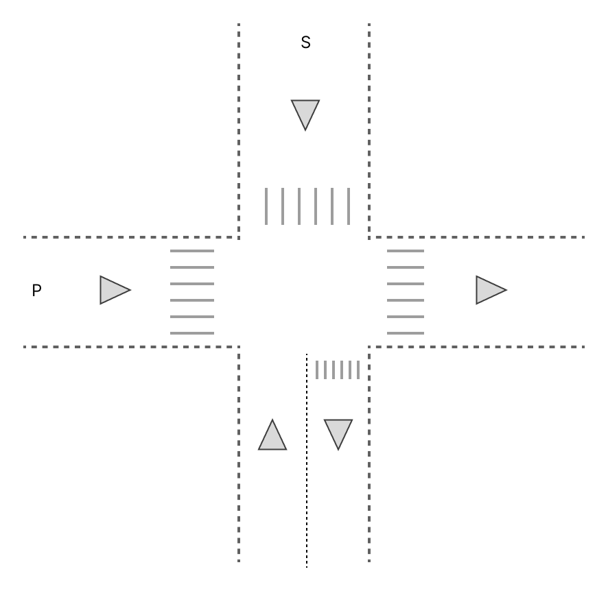
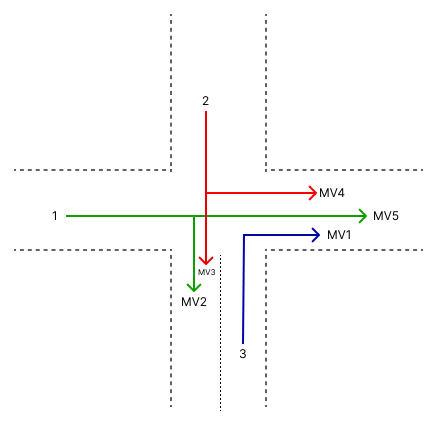
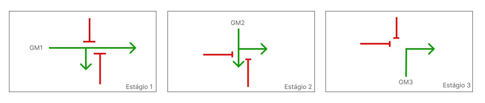
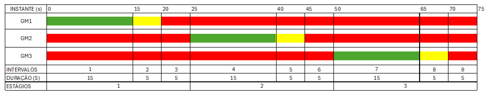

# 🚦 Sistema de Controle de Semáforo em C

Este projeto implementa a lógica de controle de um semáforo para um cruzamento com múltiplos sentidos de tráfego, seguindo as etapas de estudo e planejamento necessárias para uma programação eficiente e segura.

---

## 📋 Descrição
O programa simula o funcionamento de um sistema semafórico, controlando os tempos de verde, amarelo e vermelho de acordo com o **estudo dos movimentos**, **tabela de conflitos** e **diagramas de estágios e intervalos luminosos** previamente desenvolvidos.

---

## 🖼️ Imagem do cruzamento


---

## 📊 Estudo dos movimentos


---

## ⚠️ Tabela de movimentos conflitantes


---

## 🔄 Diagrama de estágios


---

## ⏱️ Diagrama de intervalos luminosos


---

## 🔧 Tecnologias Utilizadas
- Linguagem **C**
- Ferramentas gráficas para criação de diagramas e imagens

---

## 🚀 Como executar
1. Compile o código:
   ```bash
   gcc src/semaforo.c -o semaforo
   ```
2. Execute o programa:
   ```bash
   ./semaforo
   ```

---

## 📑 Referências
- Manual Brasileiro de Sinalização de Trânsito

